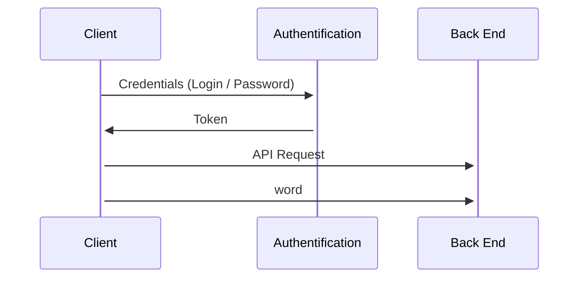
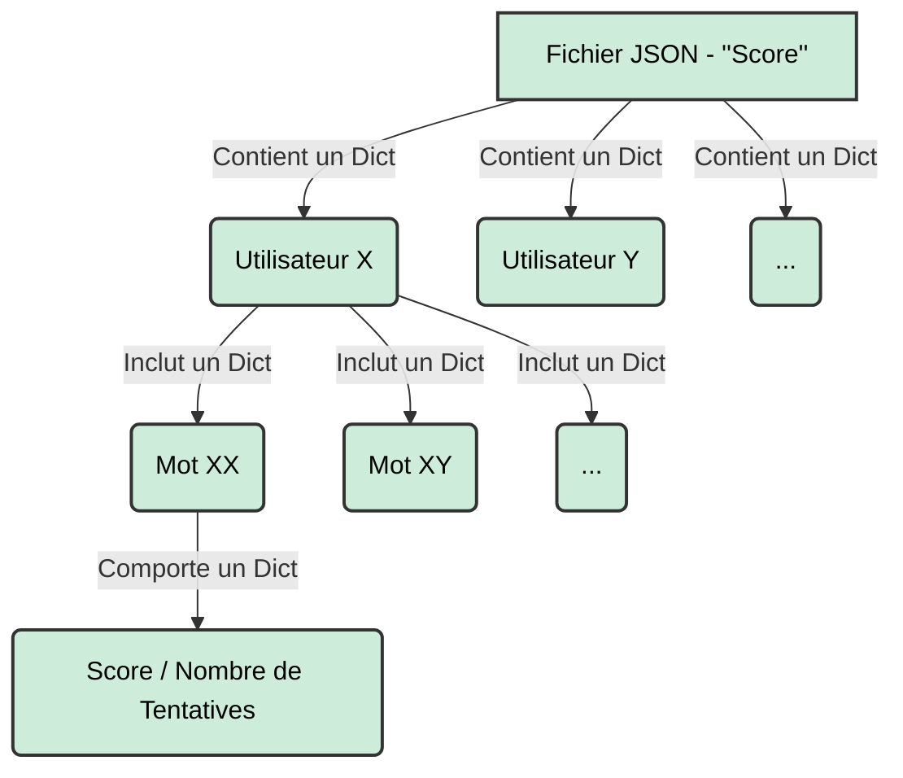

# Motus 

## Score Management

    which server are you gone use ?
    which port are you gone use ?
    which API are you gone call ? which parameters ?
    Can we handle more than one user ?
    What data do we want to store ?

### Fichier Score
Les **scores** sont stockés dans un fichier JSON comprenant différentes information qui sont visibles sur le Diagramme d'Etat ci-dessous:  

Dans la figure ci-dessus, nous pouvons observer la configuration du fichier JSON étant composé de nested dictionnaires sur 3 niveaux avec:
-   Le niveau 1 étant le dictionnaire (JSON) avec comme clés tous les utilisateurs.
-   Le niveau 2 étant le dictionnaire d'utilisateur avec comme clés tous les mots dont l'utilisateur à essayer de deviner. 
-   Le niveau 3 étant le dictionnaire des informations avec deux clés qui sont le score et le nombre de tentatives.

---
Une amélioration serait de permettre à ce que l'utilisateur soit directement lié au Nom d'Utilisateur et Mot de Passe.
---

### API and Parameters

De multiples API peuvent être utilisé afin 

