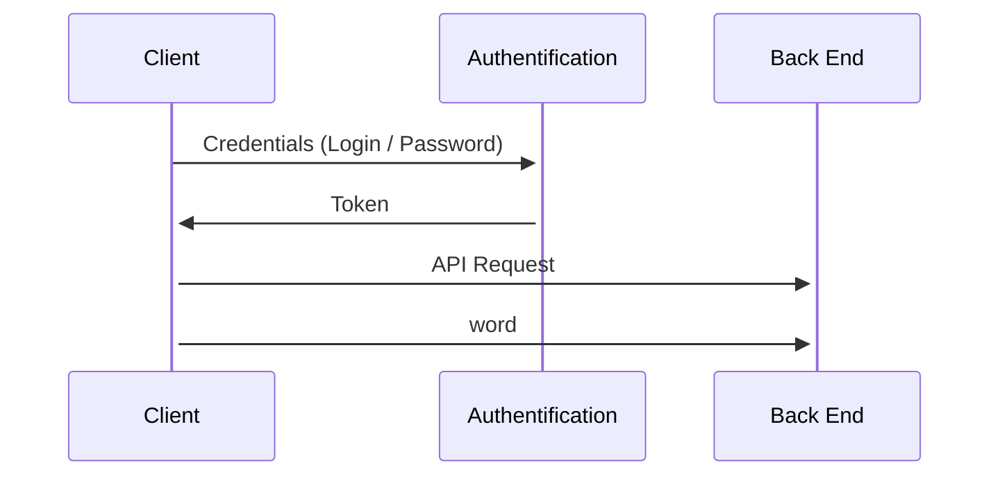

# Motus 

## Score Management

    which server are you gone use ?
    which port are you gone use ?
    which API are you gone call ? which parameters ?
    Can we handle more than one user ?
    What data do we want to store ?

#### API and Parameters

Les **scores** sont stockés dans un fichier JSON comprenant différentes information qui sont visibles sur le Diagramme d'Etat ci-dessous:  

'''mermaid
graph TD
    A[Fichier JSON - ''Score''] 
    A -->|Contient| B(Utilisateur X)
        B -->|Inclut| B1(Mot XX)
        B -->|Inclut| B2(Mot XY)
        B -->|Inclut| B3(Mot ...)
            B1 -->|Comporte un Dict| B11(Score / Nombre de Tentatives)
    A -->|Contient| C(Utilisateur Y)
    A -->|Contient| E(Utilisateur ...)
'''

The way the **score** works is that the information are stored within a .JSON file with the Users Name (a matching ID with the LOGIN/PASSWORD is the final upgrade). Theres exists differents APIs that are callable that display information about 