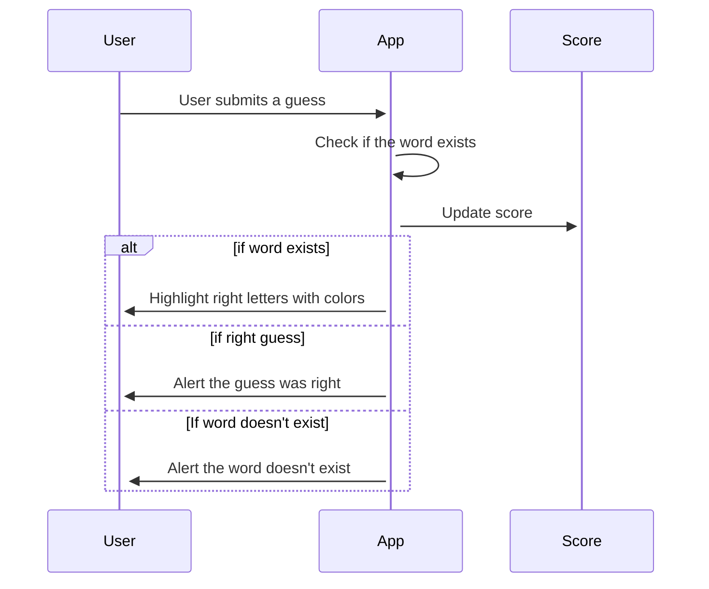
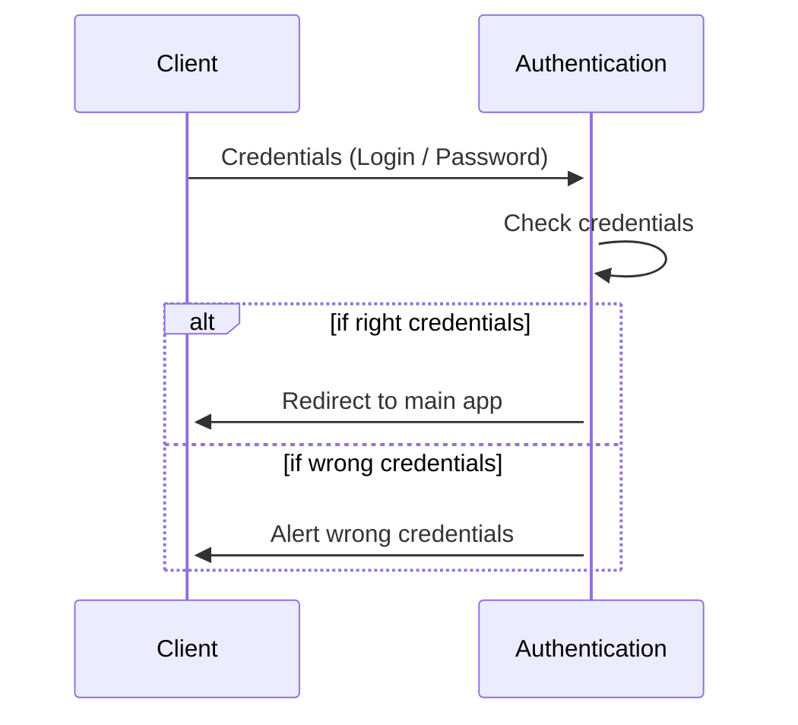
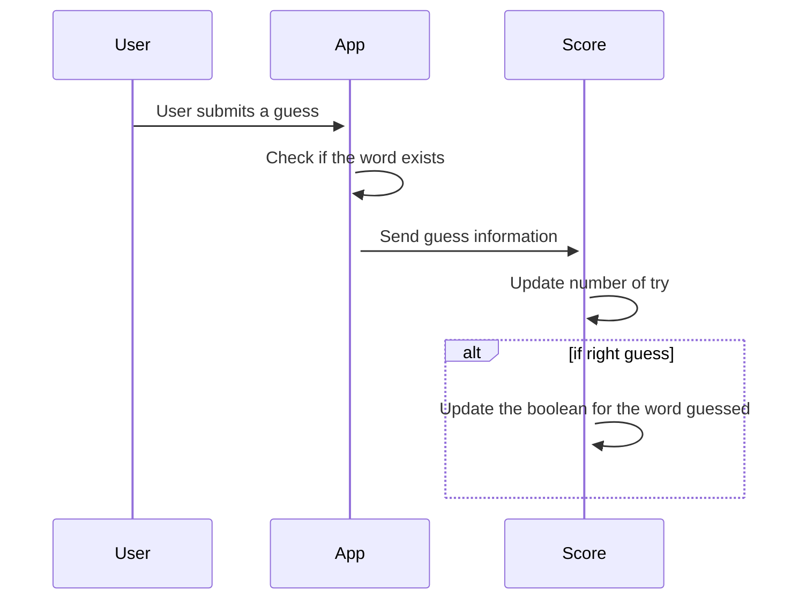
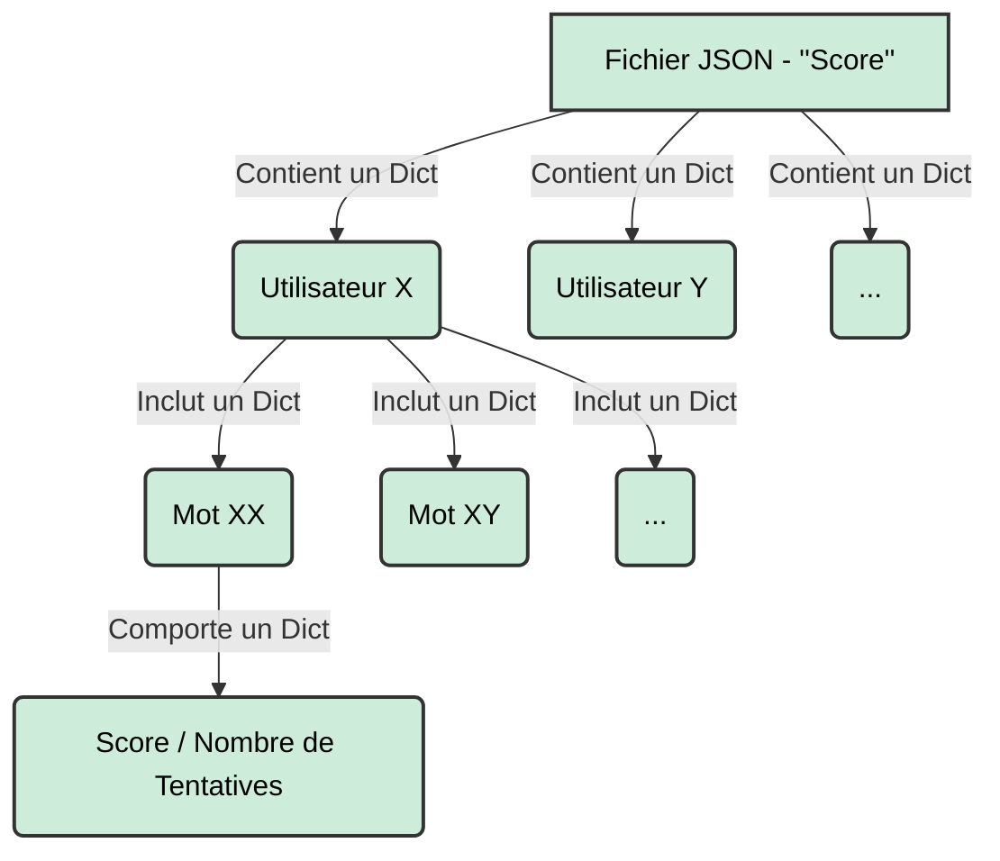

# DoLus 

## Project structure


├── authentication_app
│   ├── authentication.js
│   ├── data
│   │   └── users_authentication.json
│   ├── Dockerfile
│   ├── package.json
│   ├── package-lock.json
│   └── public
│       ├── images
│       │   └── Logo.png
│       ├── scripts
│       │   ├── login.js
│       │   ├── main.js
│       │   ├── register.js
│       │   └── scoreboard.js
│       ├── styles
│       │   ├── login.css
│       │   ├── main.css
│       │   ├── register.css
│       │   └── scoreboard.css
│       └── templates
│           ├── login.html
│           ├── main.html
│           ├── register.html
│           └── scoreboard.html
├── README.md
├── score_app
│   ├── data
│   │   └── users.json
│   ├── Dockerfile
│   ├── package.json
│   ├── package-lock.json
│   ├── score.js

---


## Prerequisite

- [Docker](https://www.docker.com/)
- [Docker Compose](https://docs.docker.com/compose/)

## Launching the app

Clone the project using bash command

```bash
git clone https://github.com/dorian-roux/DoLus-Sutom-APP
```
Launch the docker container using docker-compose

```bash
docker-compose up -d
```

Open the following URL [http://localhost:4000](http://localhost/4000)


## Front

Basic HTML∕CSS template.

## Motus app
The user will get 2 informations the length and the first letter of the word to guess.
The user must give a word of the right length.
The app will check if the word exists.
The score is updated every time the user submits a guess.
If the word exists the app will highlight the right letters at the right position in green and the right one that are in the wrong position in orange.



## Database
Authentication.json
- `username` : username
- `password` : hashed password

users.json : one dictionnary per user and a sub dictionnary per word the user has guessed.
- `username` : username
- `word` : word guessed by the user
- `score` : has the word been guessed ?
- `number_try` : how many tries has been done for this word


## Authentication
The authentication app allows the user to enter his credentials then it checks inside a json file if the credentials do exist.
If it does the user is redirected to the main app otherwise there is an alert telling the user that he entered wrong credentials.



## Score Management

When the user submits a guess the information is sent to the score app.
The score app updates the score file according to the guess.
The score page shows the informations stored in the score file where we can see the average number of try, the number of words found.




## Monitoring


### Fichier Score
Les **scores** sont stockés dans un fichier JSON comprenant différentes information qui sont visibles sur le Diagramme d'Etat ci-dessous:  



Dans la figure ci-dessus, nous pouvons observer la configuration du fichier JSON étant composé de nested dictionnaires sur 3 niveaux avec:
-   Le niveau 1 étant le dictionnaire (JSON) avec comme clés tous les utilisateurs.
-   Le niveau 2 étant le dictionnaire d'utilisateur avec comme clés tous les mots dont l'utilisateur à essayer de deviner. 
-   Le niveau 3 étant le dictionnaire des informations avec deux clés qui sont le score et le nombre de tentatives.

---
Une amélioration serait de permettre à ce que l'utilisateur soit directement lié au Nom d'Utilisateur et Mot de Passe.
---

### API and Parameters

De multiples API peuvent être utilisé afin 

