# Microservice Project 2022 - DoLus 


&nbsp;
&nbsp;

The microservice unit had as its objective to progressivly build a web application following the concept of the SUTOM Game (a game where a user try to guess a word) by using a microservice architecture. 

# Table of Contents
1. [Project structure](#project-structure)
2. [Prerequisite](#prerequisite)
3. [Launch the APP](#launch-the-app)
4. [Front](#front)
5. [Quick Description of DoLus, our SUTOM Game](#quick-description-of-dolus-our-sutom-game)
6. [AUTHENTICATION](#authentication)
7. [Score Management](#score-management)
8. [DoLus Home Page](#dolus-home-page)
9. [Monitoring](#monitoring)
10. [Improvements and Next Features](#improvements-and-next-features)


---

## Project structure

Here is an overview of the path of this repository. As a concern of visibility, we decided to remove the NODE JS packages (within each microservice)


├── authentication_app  
│   ├── authentication.js  
│   ├── data  
│   │   └── users_authentication.json  
│   ├── Dockerfile  
│   ├── package.json  
│   ├── package-lock.json  
│   └── public  
│       ├── images  
│       │   └── Logo.png  
│       ├── scripts    
│       │   ├── login.js  
│       │   ├── main.js  
│       │   ├── register.js  
│       │   └── scoreboard.js  
│       ├── styles    
│       │   ├── login.css  
│       │   ├── main.css  
│       │   ├── register.css  
│       │   └── scoreboard.css   
│       ├── templates    
│       │   ├── login.html  
│       │   ├── main.html  
│       │   ├── register.html  
│       │   └── scoreboard.html   
├── FrontCapture  
│   │   └── ...  
├── motus_app  
│   ├── data  
│   │   └── grid.json  
│   │   ├── liste_francais_utf8.txt  
│   │   ├── liste_francais.txt   
│   ├── Dockerfile    
│   ├── package.json  
│   ├── package-lock.json  
│   ├── index.js  
├── prometheus  
│   │   └── prometheus.yml    
├── score_app  
│   ├── data  
│   │   └── users.json  
│   ├── Dockerfile  
│   ├── package.json  
│   ├── package-lock.json  
│   ├── score.js  
├── docker-compose.yml  
├── haproxy.cfg  
├── README.md  


---


## Prerequisite

To execute and launch the project, you need to install the following softwares/tools.
- [Docker](https://www.docker.com/)
- [Docker Compose](https://docs.docker.com/compose/)

---

## Launch the APP

First, you need to clone the repository. Below, is the git command to clone the project.
```bash
git clone https://github.com/dorian-roux/DoLus-Sutom-APP
```

Then, you need to execute the docker-compose using the following command.
```bash
docker-compose up -d
```

Finally, if you arrive there without any troubles (else you might want to check your docker installation), then you are all set and can launch our SUTOM Game using the PORT 4000 on the LOCALHOST

---

## Front

We decided to keep a relatively basic design of the app by using HTML/CSS to build the front part of the project.

---

## Quick Description of DoLus, our SUTOM Game

DoLus, our SUTOM Game has 3 differents sections that are the authentication, the game and the score.

To describe it in a few words, we can say that DoLus gives a word daily to the users and the users must find the words within 5 attempts. The users can check his results over the daily word but also from the beginning of its profile.

Below is a sequence diagram quickly explaning the user/score
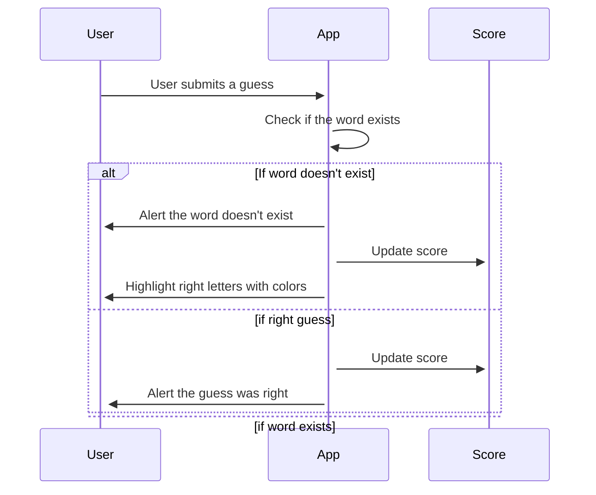
---

&nbsp;

## AUTHENTICATION

### Main Idea
The service of authentication allows the user to perform two actions that are: 
  - `REGISTER` : create a new account
  - `LOGIN` : connect to an existing account
  
The authentication verifies within an account databases whether the credentials do exist or not. Depending on the taken action, the user will in case of "success" be relocated to the LOGIN or HOME Page.

&nbsp;
### Database Content
The users identfiers database is stored as a FLAT JSON file containing the following informaiton:
  - `username` : username
  - `password` : hashed password

&nbsp;

### Users/Authentication Relationships

Here is a sequence diagram explaining the Users/Authentication relationships.
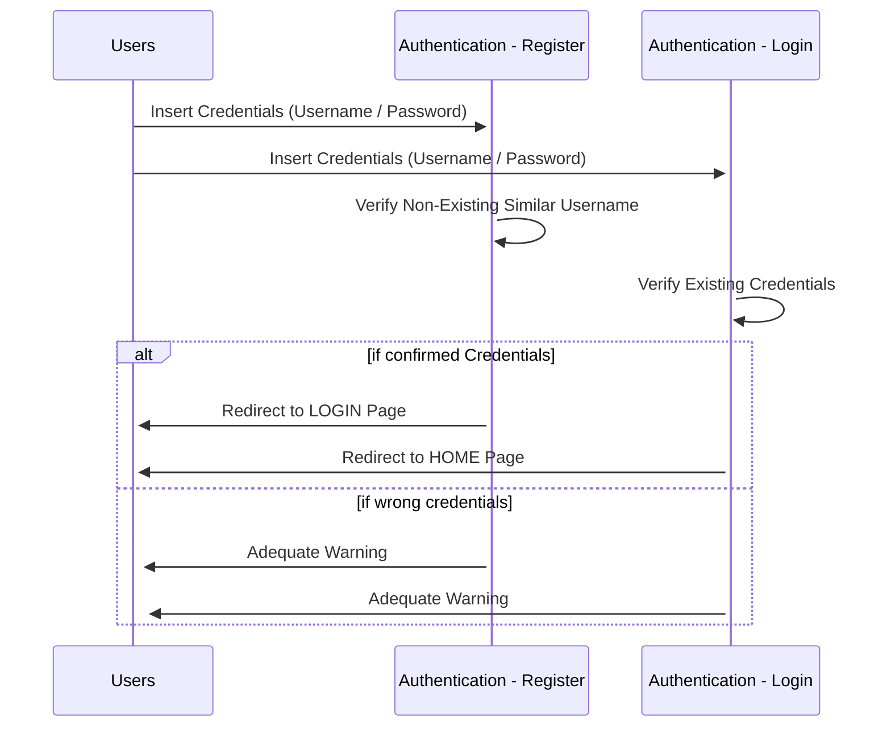

&nbsp;

### Authentication FRONT Capture

Register Account
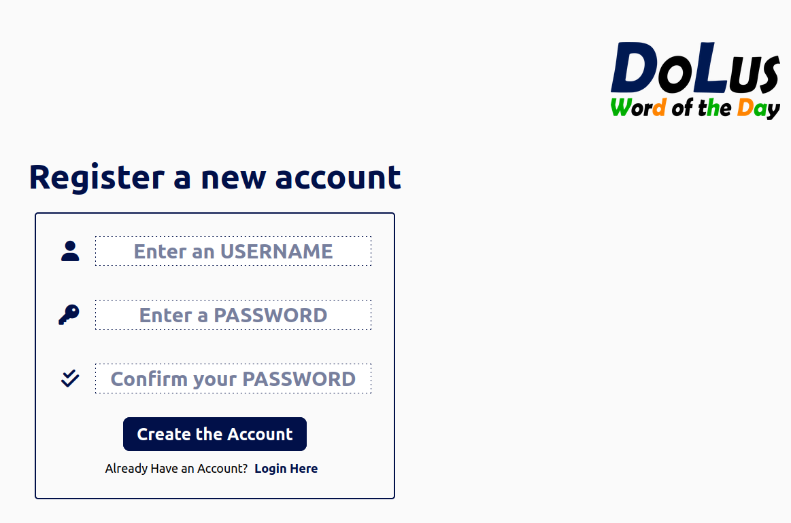

Login Account
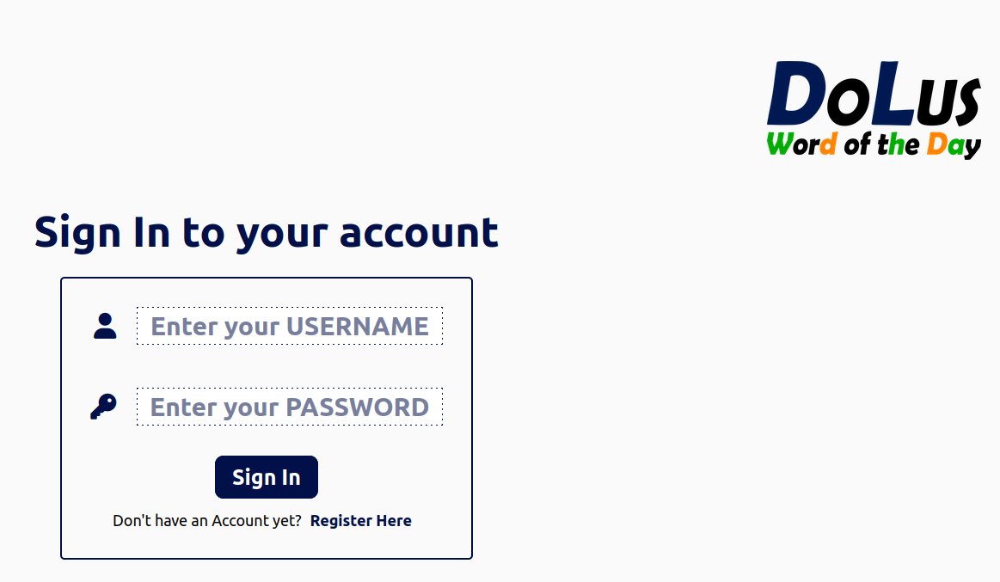


&nbsp;
&nbsp;

## Score Management
### Main Idea
The purpose of the score management is to keep a record of the game results. We do not only keep track of the current work score but also the whole profile results. 

The score is updated after each guess of the user, from which we incremente the number of attempts the user has done for the current word but also if he has find the word or not.

&nbsp;

### Database Content

The users scores database is stored as a FLAT JSON file containing the following informaiton:
  - `username` : username
  - `word` : word to guess
  - `score` : has the word been guessed (0 or 1)?
  - `total_attempts` : how many tries has been done for this word

We can have a better understanding of this file by looking at the below figure

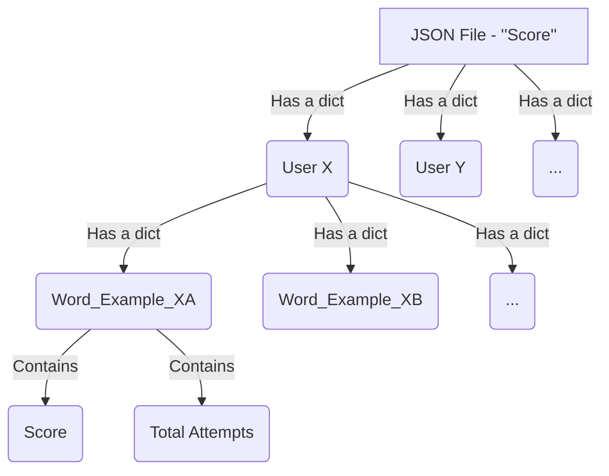

&nbsp;

### Users/Authentication Relationships

Here is a sequence diagram explaining the Users/Score relationships.

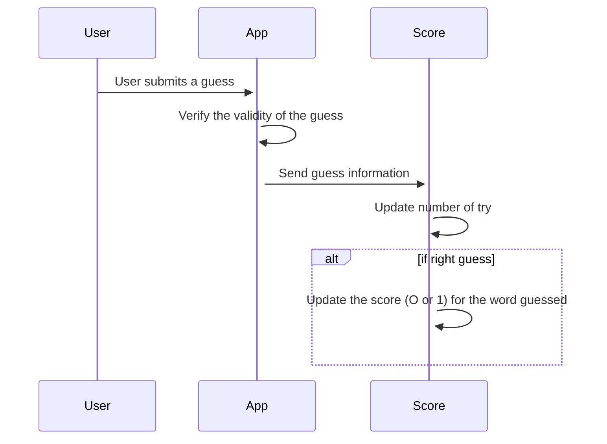


### Score Management FRONT Capture

Register Account
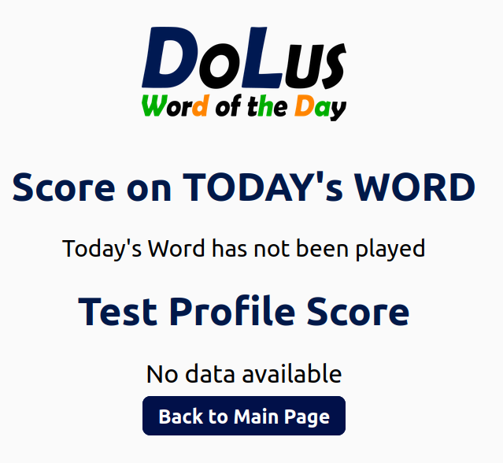

Login Account
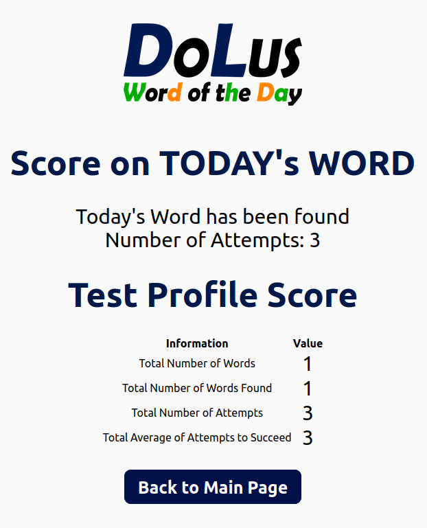


&nbsp;
&nbsp;


## DoLus Home Page

The index service is the one which creates the connections between them all and contains also the statics files (html/css/js static/)

&nbsp;

### Features of the GAME

We wanted to make the game more reliable by implementing a Succes/Fail where the user has 5 chances to guess the word. 

#### Keep the GUESSES

We also wanted to make sure the user could take a break and get back after some time to guess again the word, from which we implemented a flat file database that contains:
  - `username` : username
  - `date` : the date where the user played
  - `word` : word_to_guess
  - `discovered` : has the word been discovered
  - `grid` : the content of the grid 
  - `Level` : the final level reach by the user (the level being the amount of guess)
  - `Scheme` : a dict with the grid pattern (amount of characters etc)


#### Others Features

There exist other features, such as the seed modification to randomly get a new word.

&nbsp;

### Users/APP Relationships

Here is a sequence diagram explaining the Users/Score relationships.

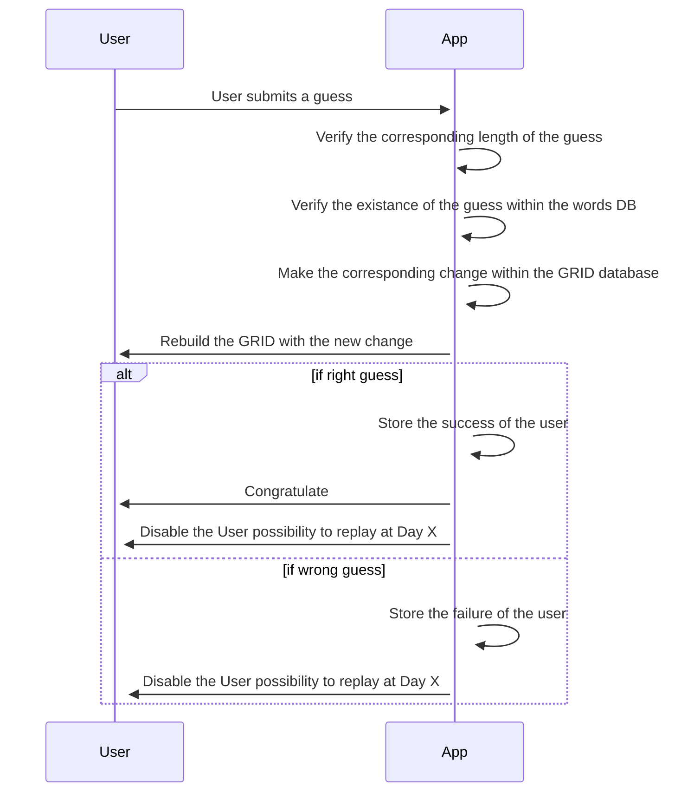
&nbsp;

### Home Page FRONT Capture

Success Game
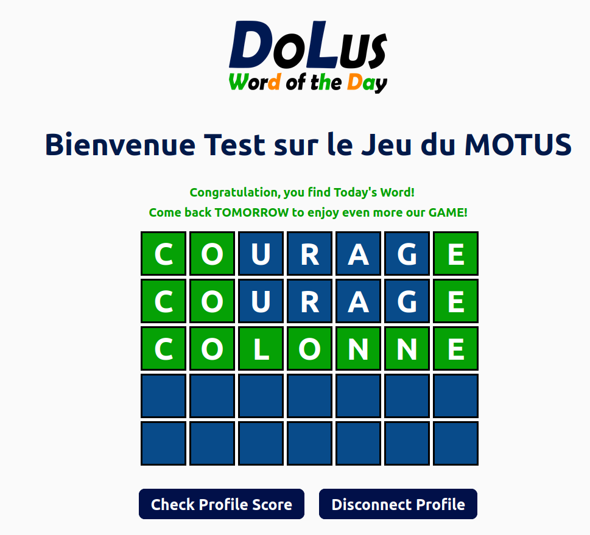

Failed Game
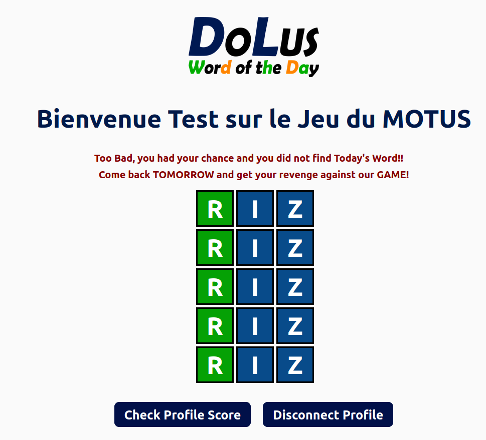


&nbsp;
&nbsp;


## Monitoring

the monitoring is done by using Loki, Prometheus et Grafana.

Theres is some steps to get the logs or metric from Loki and Prometheus. 

The steps are the following (for prometheus)
- Get connected to Grafana using http://localhost:3000.
- Use admin / admin as identifiers (username, password)
- Once connected, go to add a data source with as URL : http://prometheus:9090
- Create a new Dashboard
- Select prometheus as the source
- Select the desired metric
- And your graphic is created

The steps are relatively similar with Loki.

&nbsp;
&nbsp;

## Improvements and Next Features

If someone wanted to continue the development of our project, well, he could easily. There was many features that we wanted to implment and we could not by lack of knowledge but mostly lack of time. Among them there was:
-   Improvement of the security, OpenID, Oauth2 and better database systems (such as postgresDB).
-   Add the HAPROXY
-   Improvement of the monitoring on Grafana with better logs from Loki and metrics from Prometheus.
-   Fix the possibles existing bugs that we could not find due to an absence of unit testing.
-   Improve the design by using some frameworks as React or Angular.
-   Improve the structure of the project, better scripts, with more comments, better functions, etc.
-   And why not modifying the type of game?


